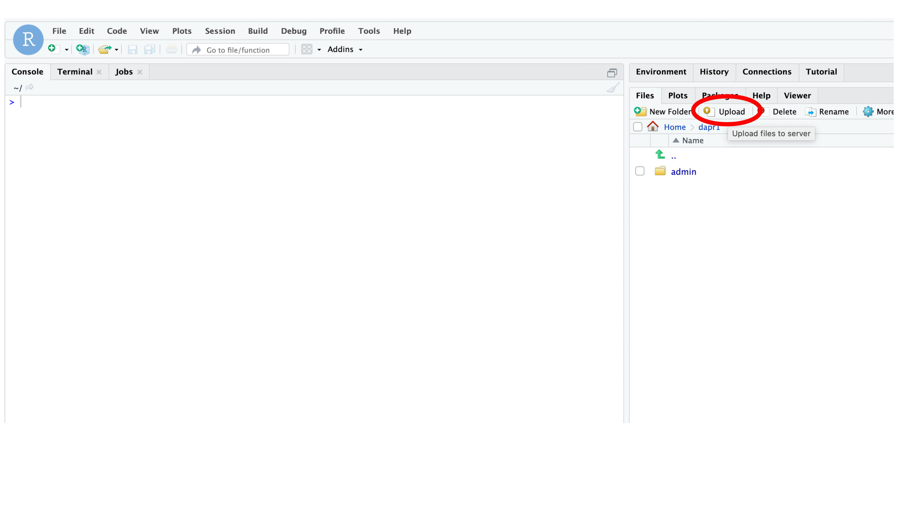
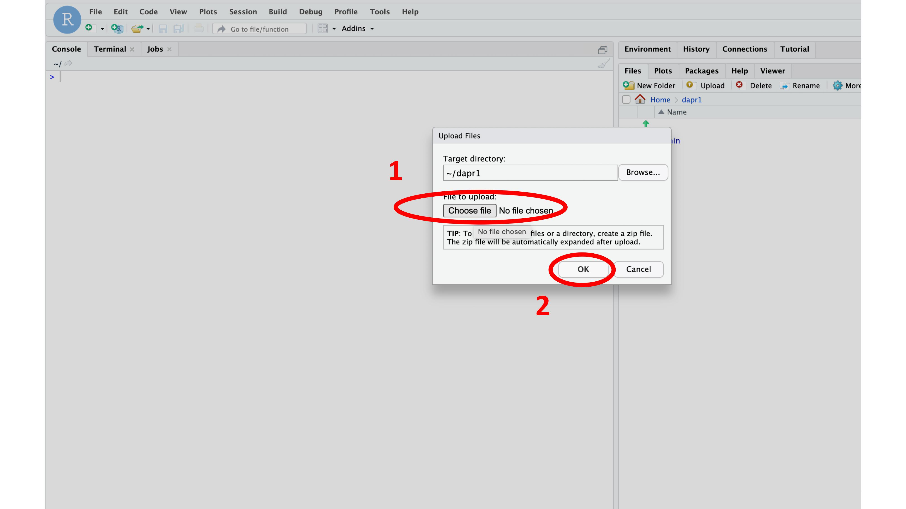
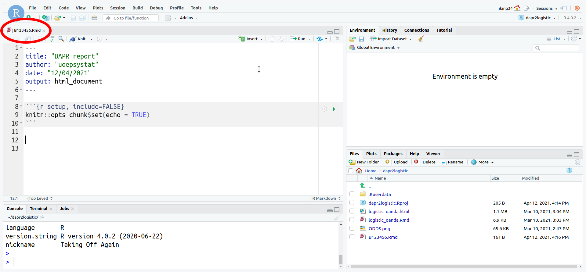
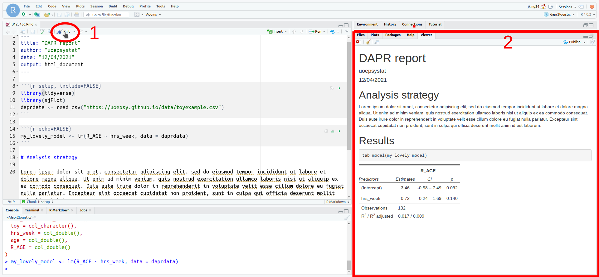
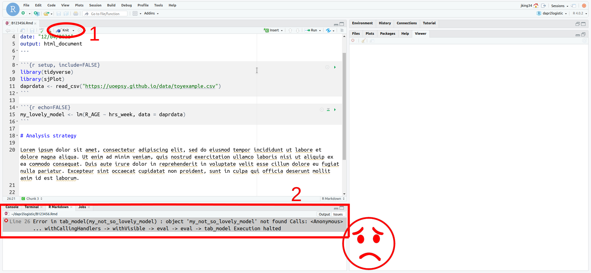
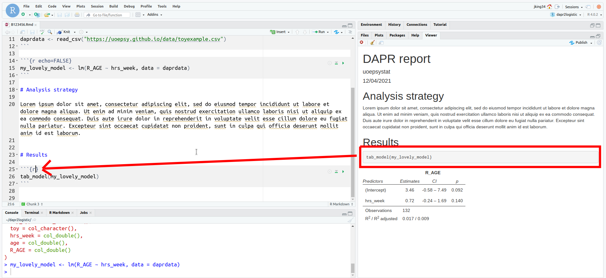
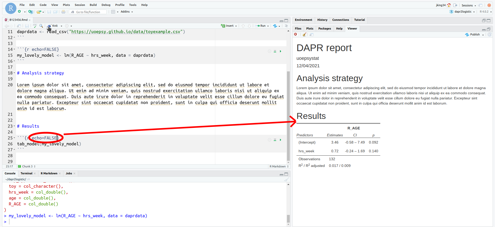
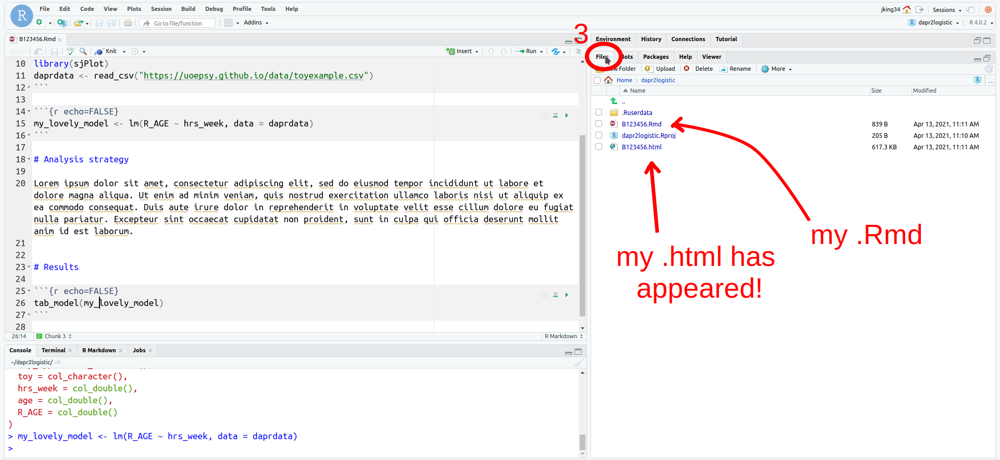
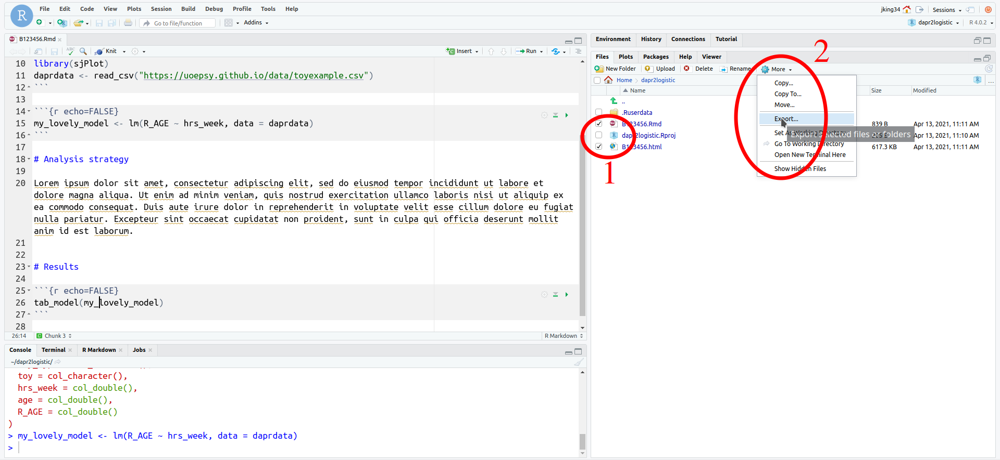

<script src="https://ajax.googleapis.com/ajax/libs/jquery/3.1.1/jquery.min.js"></script>
  
  <style>
  .zoomDiv {
    opacity: 0;
    position:fixed;
    top: 50%;
    left: 50%;
    z-index: 50;
    transform: translate(-50%, -50%);
    box-shadow: 0px 0px 50px #888888;
    max-height:100%; 
    overflow: scroll;
  }

.zoomImg {
  width: 200%;
}
</style>
  
  
  <script type="text/javascript">
  $(document).ready(function() {
    $('body').prepend("<div class=\"zoomDiv\"></div>");
    // onClick function for all plots (img's)
    $('img:not(.zoomImg)').click(function() {
      $('.zoomImg').attr('src', $(this).attr('src'));
      $('.zoomDiv').css({opacity: '1', width: '60%'});
    });
    // onClick function for zoomImg
    $('img.zoomImg').click(function() {
      $('.zoomDiv').css({opacity: '0', width: '0%'});
    });
  });
</script>

:::red
Assignments in the statistics courses in psychology at UoE will require you to submit according to one of the following:  

  - **.Rmd** file (DAPR1 Lab tests)
  - **.Rmd** and **.html** files (DAPR1, DAPR2 & DAPR3 Reports)
  - **.Rmd** and any one of **.html**/**.pdf**/**.docx** (USMR & MSMR Reports)
  
:::

# If there is a template .Rmd file provided

For some assignments (DAPR1 Lab tests, DAPR1 Report, USMR Report) there is a template **.Rmd** file provided for you, in which you can write your answers. 

1. Download the **.Rmd** file from Learn (right click on the link, and choose "save as" to save to a location on your computer)
2. Open the **.Rmd**
    + **Option A**. 
    If you have RStudio installed on your computer, then open the downloaded **.Rmd** in Rstudio.
    + **Option B**.  
    If you are using RStudio on the PPLS Server (rstudio.ppls.ed.ac.uk), you will need to upload the file to your server space  
    ```{r results="asis",echo=FALSE, out.width="20%"}
     
    cat("   ")
    
    ```
    <br><small>Click on a screenshot to zoom in, then click on it to minimise it</small>
3. Save your file as B123456.Rmd (replace with your exam number)
    - file > save as
    - make sure that the file you are writing in from now on is this file.  
    ```{r results="asis",echo=FALSE, out.width="20%"}
     
    ```
    <br><small>Click on a screenshot to zoom in, then click on it to minimise it</small>
4. Write! (and make sure to regularly save your document!)  


# If there is no template provided
 
If there is no template **.Rmd** file provided, this means that you are to write your assignment from a blank slate.  

1. Open Rstudio
2. Create a new Rmarkdown document
3. Save your file as B123456.Rmd (replace with your exam number)
    - file > save as
    - make sure that the file you are writing in from now on is this file.  
    ```{r results="asis",echo=FALSE, out.width="20%"}
     
    ```
    <br><small>Click on a screenshot to zoom in, then click on it to minimise it</small>
4. Write! (and make sure to regularly save your document!)  


:::frame
Instructions on Learn for the specific assignment will provide you with guidance on how to structure your report, but some general tips are to try to include:

A) **Clear written details of the analysis conducted** in order to answer the research question(s), including transparency with regards to decisions made about the data prior to and during analysis. 
B) **Results**, in appropriate detail (for instance, a test statistic, standard error and p-value, not just one of these).  
C) **Presentation** of results where appropriate (in the form of tables or plots).  
D) **Interpretation** (in the form of a written paragraph(s) referencing relevant parts of your results) leading to a conclusion regarding the research question(s).    

The code you write should successfully conduct the analysis described in A), which returns B). You should also include the code to produce C).  

**Stop and think:**   
The compiled document will ideally contain no visible R code. This means that a large part of the challenge comes in clearly describing all aspects of the analysis procedure. A reader of your compiled document should be able to more or less replicate your analyses **without** referring to your R code.  

:::

# Check that your code runs/that your document compiles

```{r results="asis",echo=FALSE, out.width="20%"}

cat("  ")

```
<br><small>Click on a screenshot to zoom in, then click on it to minimise it</small>


:::yellow
**RMarkdown compiles using its own environment**

When you "knit" an RMarkdown document, the document compiles starting from a **blank slate**. This means that if you haven't written in your RMarkdown document where to read the data from, it will not be to access the data **even if you can see the data in your environment (top-right window of RStudio)**.

It *also* means that you need to pay special attention to the order in which code is written in your document.
  
Consider the code below. I could run this code manually (in *my* environment) by running the second line (creating the `kermit` object) *then* the first line (calculating the mean). #
When you knit an RMarkdown document with this code in it, it will run sequentially, which means that it will try to calculate the mean of `kermit` **before it knows what `kermit` is!**.  

```{r echo=T, eval=F}
mean(kermit)
kermit <- c(5,7,2,5,205,3,5,3)
```

:::

**Common errors and things to look for**  

- **... "not found"**: this could be a function, or an object. Check that you have loaded the packages containing your functions, and check that you have defined your objects in the RMarkdown document. Check the order of these! 
  - e.g. If you use the `plot_model()` function from the **sjPlot** package, have you loaded `library(sjPlot)` in the document? and have you loaded it in a line *earlier* than your first use of `plot_model()`?  
- Data not loaded in *in the document*
- commas, brackets etc. (the usual)
- inline code (remember [what inline R code is for, and how to use it](https://bookdown.org/yihui/rmarkdown-cookbook/r-code.html) - don't just write entire paragraphs of text inside it)


# Check that everything is displaying correctly. 

You can control whether the code in a code-chunk gets shown/evaluated etc using chunk-options such as echo, eval, include, warning, message etc. See [here](https://rmarkdown.rstudio.com/lesson-3.html) for more info. 

```{r results="asis",echo=FALSE, out.width="20%"}

cat("  ")

```
<br><small>Click on a screenshot to zoom in, then click on it to minimise it</small>

# Where (and what) are my files?  

:::red
When you click "knit" on your **.Rmd**, if the document has successfully compiled (no errors), then the compiled document (e.g. **.html**) will be created in the same folder as where your **.Rmd** is saved.  
:::

```{r results="asis",echo=FALSE, out.width="20%"}

cat("  ")

```
<br><small>Click on a screenshot to zoom in, then click on it to minimise it</small>

1. When you knit an RMarkdown document, the compiled document (unless there are errors in compilation) will be saved **in the same place as your .Rmd document**.  
2. It is one or both of these two files, B123456.Rmd and B123456.html which are required for submission (check assignment instructions)

# Getting my file(s) to turnitin

:::frame
If you are working on the Rstudio PPLS Server, you need to first export the file(s) to your computer.  
1. Tick the box(es) next to relevant files  
2. Click More, then Export  
3. Save to your computer  
(You won't be able to open the .rmd on your computer (because you don't have rstudio installed), but that is okay, you can still submit this file to turnitin.  
```{r results="asis",echo=FALSE, out.width="20%"}

```

If you are using Rstudio installed on your own computer, you can find both your files wherever you saved your .Rmd file! 
:::

- Check your files are named appropriately (just your exam number)
- Go to turnitin and follow instructions

Turnitin will show you a preview of files when you submit them, and the viewer will probably mess-up what the .html looks like. Do not worry if some figures and tables are not shown in Turnitin, but are definitely visible in your original file. We will mark the original files. 


