**Click on a screenshot to zoom in, then click on it to minimise it**


# Instructions

1. **Download the .Rmd document from Learn.**  
```{r echo=FALSE, out.width="20%"}
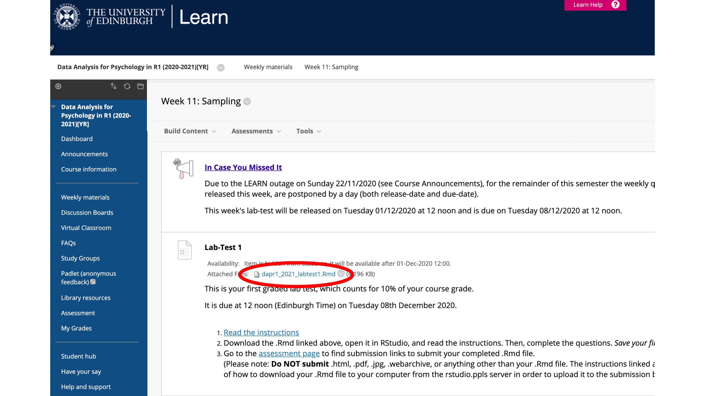
cat("   ")
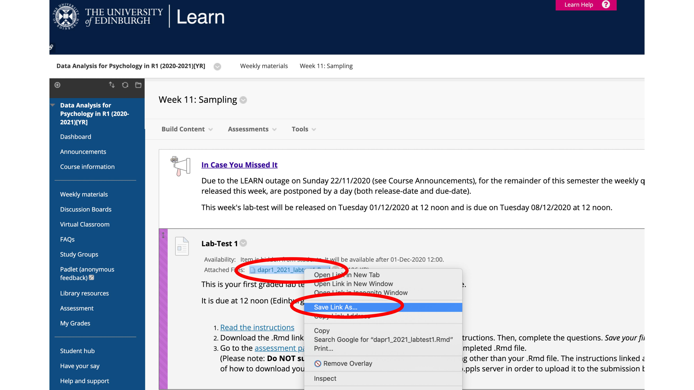
```

1. **(If you are using the RStudio Server) upload the .Rmd file to your project.**  
```{r results="asis",echo=FALSE, out.width="20%"}
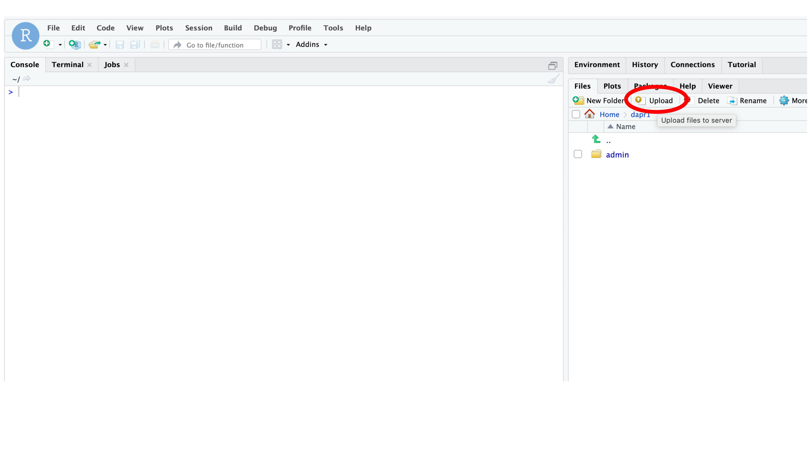 
cat("   ")
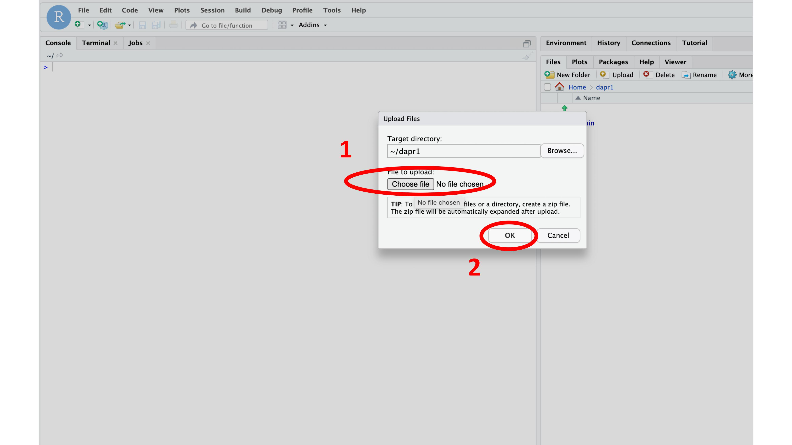
```

1. **Open the .Rmd**  
```{r results="asis",echo=FALSE, out.width="20%"}
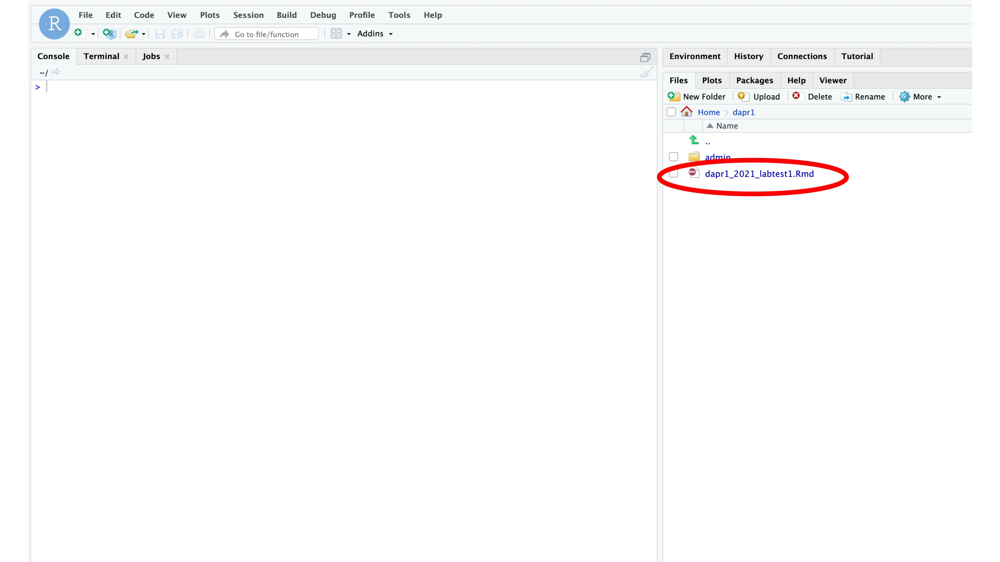 
cat("   ")
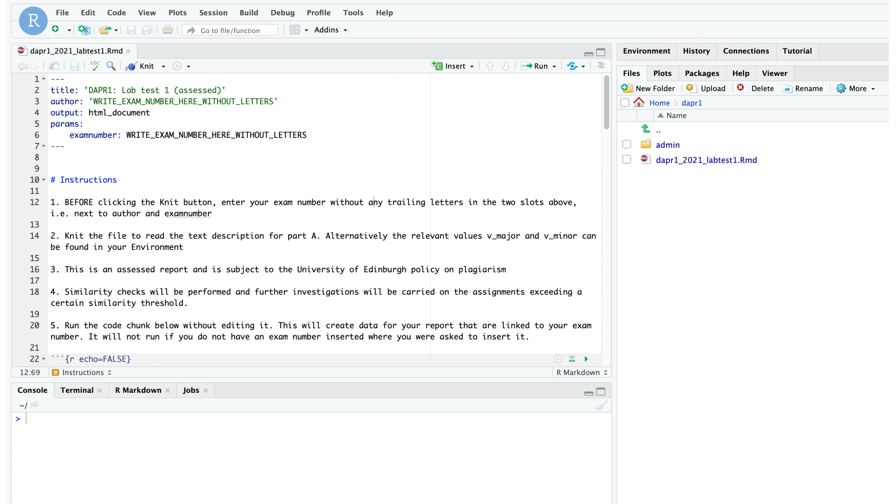
```

1. **Add your exam number at the relevant places at the top of the document**  
```{r results="asis",echo=FALSE, out.width="20%"}
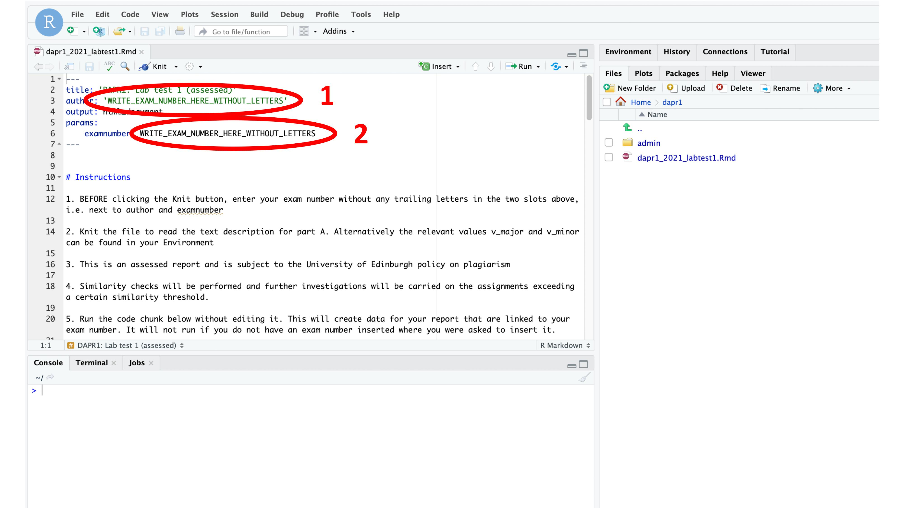 
cat("   ")
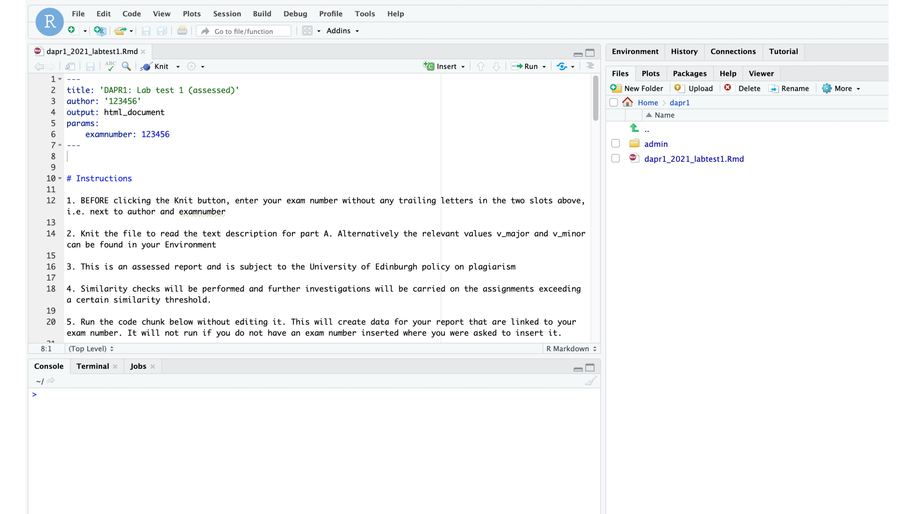
```

1. **Rename the .Rmd file with your exam number**  
```{r results="asis",echo=FALSE, out.width="20%"}
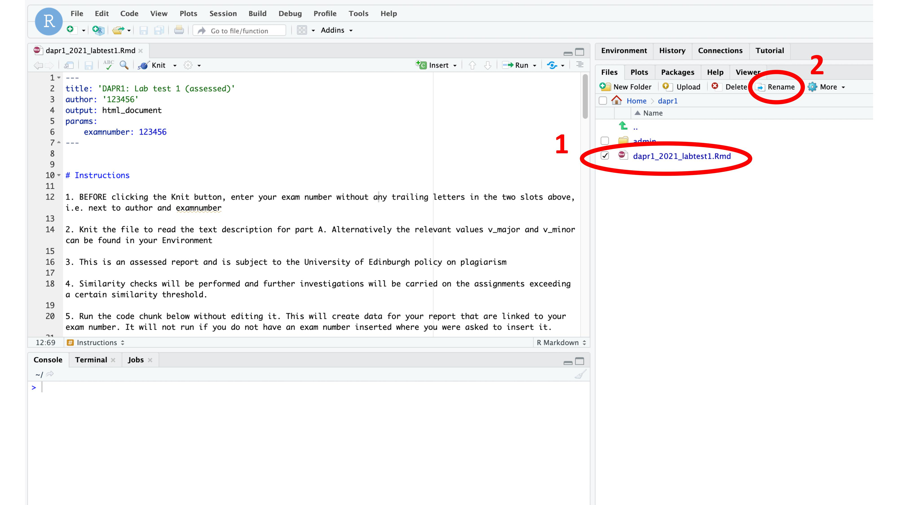 
cat("   ")
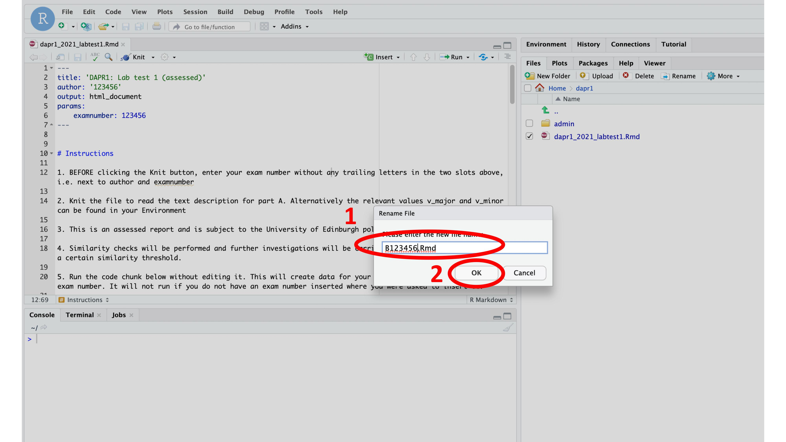
```

1. **READ THE INSTRUCTIONS**  
```{r results="asis",echo=FALSE, out.width="20%"}
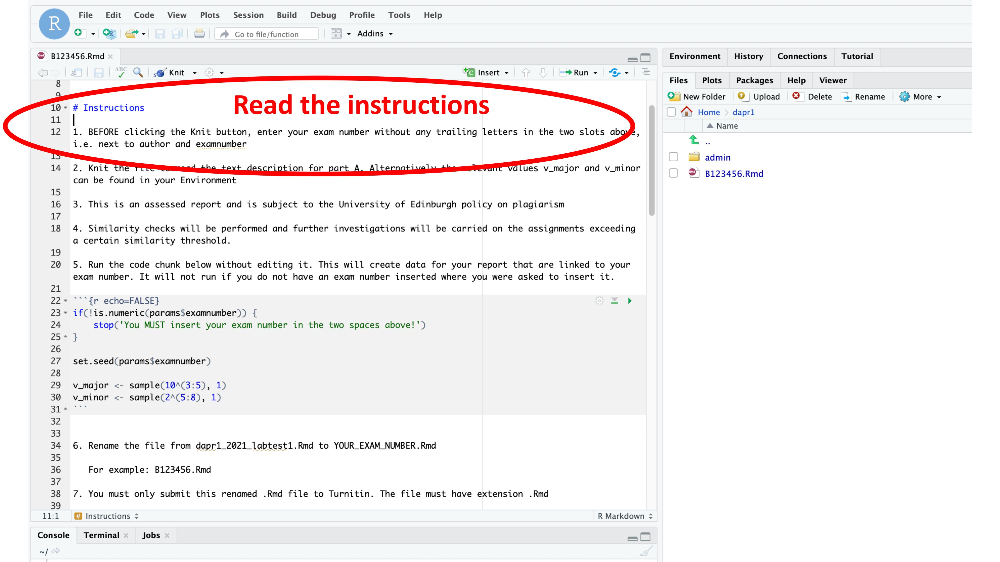
```

1. **If present, run the code-chunk that loads the data without editing it.** 
```{r results="asis",echo=FALSE, out.width="20%"}
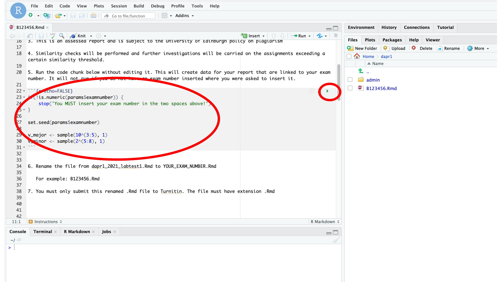
```
 
1. **Complete the questions using R code**   
    - All code should be within code chunks and these should be included and visible in the submitted file. 
    - For each question, your answer should be saved to a named object. The name of the object will be given within each chunk.
    - The last line within each code chunk should print the result for that question.  
    
    ```{r results="asis",echo=FALSE, out.width="20%"}
    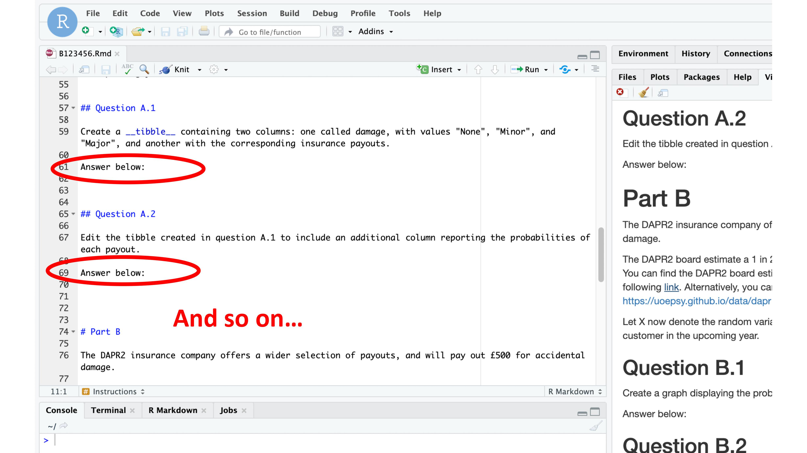
    ```

1. **Check that the .Rmd successfully 'knits' to .html, and that everything is displaying correctly**  
```{r results="asis",echo=FALSE, out.width="20%"}
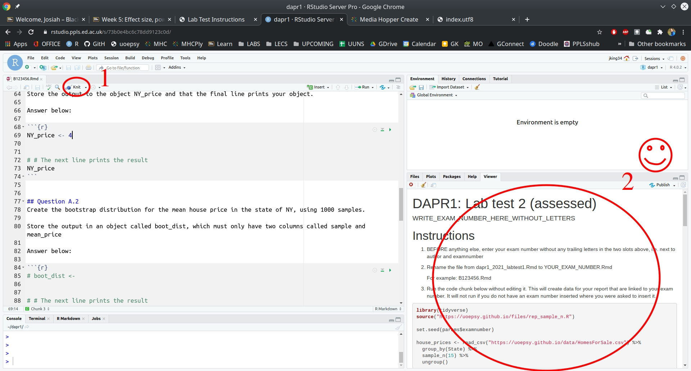
cat("  ")
knitr::include_graphics("images-labtest/0015a.jpg")
cat("<br><br>")
```


1. **MAKE SURE YOU SAVE YOUR FILE!**  <br><br>


1. **(If you are using the RStudio Server) download your completed .Rmd file to your computer**  
```{r results="asis",echo=FALSE, out.width="20%"}
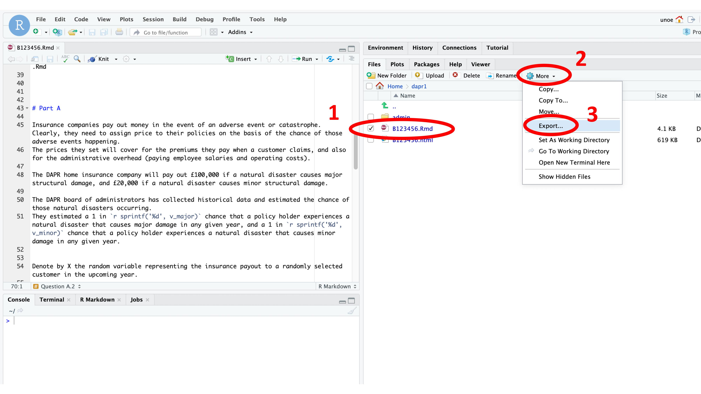
```
  
1. **Go to the assessments page, review the own-work declaration, and follow instructions to upload your completed .Rmd file to Turnitin**   
```{r results="asis",echo=FALSE, out.width="20%"}
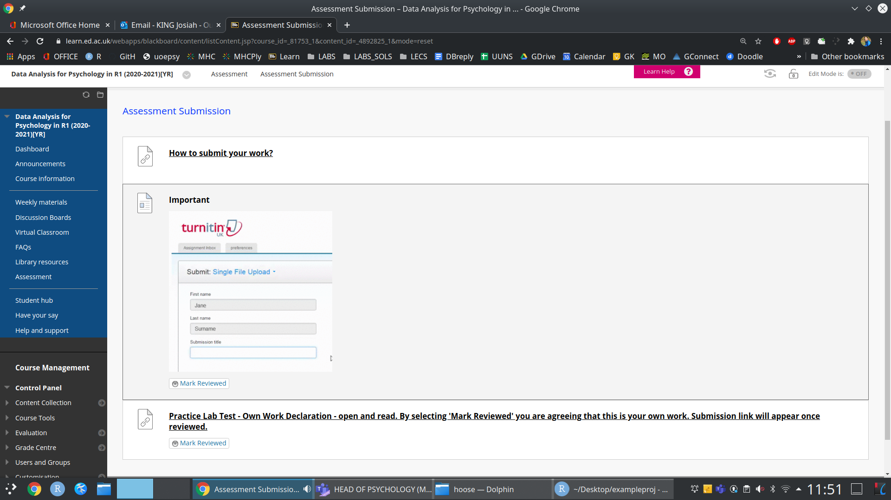
```


<script src="https://ajax.googleapis.com/ajax/libs/jquery/3.1.1/jquery.min.js"></script>
  
  <style>
  .zoomDiv {
    opacity: 0;
    position:fixed;
    top: 50%;
    left: 50%;
    z-index: 50;
    transform: translate(-50%, -50%);
    box-shadow: 0px 0px 50px #888888;
    max-height:100%; 
    overflow: scroll;
  }

.zoomImg {
  width: 100%;
}
</style>
  
  
  <script type="text/javascript">
  $(document).ready(function() {
    $('body').prepend("<div class=\"zoomDiv\"></div>");
    // onClick function for all plots (img's)
    $('img:not(.zoomImg)').click(function() {
      $('.zoomImg').attr('src', $(this).attr('src'));
      $('.zoomDiv').css({opacity: '1', width: '60%'});
    });
    // onClick function for zoomImg
    $('img.zoomImg').click(function() {
      $('.zoomDiv').css({opacity: '0', width: '0%'});
    });
  });
</script>


