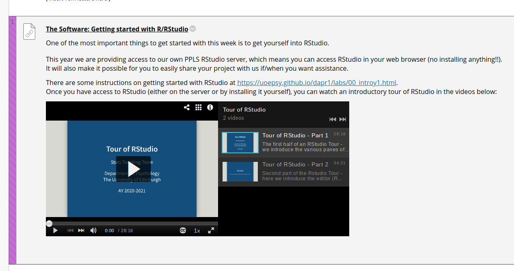

```{r setup, include=FALSE}
knitr::opts_chunk$set(echo = FALSE)
```

# Record/Upload

Record and upload your lecture chunks to MediaHopperCreate (MHC), either via kaltura, or via .mp4 upload. 

I have not used kaltura, so I can't help here, but I'm told that it automatically uploads to MHC?  
For .mp4 upload:
- log in to MHC, and click Add New > Media Upload. 

Please try to follow naming conventions, of *course*_week*weeknr*_*lecnr*.   
For example: **usmr_week1_1**  

If uploading .mp4, once uploaded it may take time for MHC to "process" the media. Check back in an hour or so.  

<hr>
<hr>

# In Media Hopper Create  
In MHC "My Media" (https://media.ed.ac.uk/my-media)  

## Request captioning 

1. select recording, click **actions** > **caption & enrich**, and submit the request for machine captions. 
2. wait (c30mins for a 10min vid?). You will be able to tell when it has completed because it will populate your video with lots of "tags".  


## Create a quiz 

1. Edit recording for video (pencil icon)
2. "launch editor"
3. LHS menu of editor gives two icons, bottom one (video) selected by default. select the upper one (quiz)#
4. Click start (it copies the media so there will now be two things in MHC - your original vid, and the "[vid name] - Quiz". 
5. Skip to relevant places in lecture, and click add question where you want to add questions. 
    
### Quiz settings:  

6. set the Welcome message: 

> Throughout this lecture recording there are checkpoint questions for you to complete. These are NOT assessed, but serve as little "checkpoints" for you to use to make sure you are following along with the content. If you don't know or get an answer wrong, try
skipping back to re-watch the relevant section of the lecture. 

7. Uncheck **Allow Download of Questions List** - Allow viewers to download the list of questions before starting the quiz

8. Check **Do not Allow Skip** -  Users must submit an answer before proceeding forward.  
  
  
## Add the stats team as collaborators (to the quiz, not the video).  
(this will help us to help you, and also allow us to keep track of views etc).  
MHC instructions for this are [here](http://www.docs.is.ed.ac.uk/skills/documents/Media%20Hopper/3848.pdf) (paraphrased below).  

1. Edit recording for QUIZ (**not** the video)  
2. Click on the *collaboration* tab  
3. Click *add collaborator* 
4. Add as collaborators: Aja Murray, Josiah King, Umberto Noe  
  You can search via uun: amurra14, jking34, unoe
5. Give both co-editor and co-publisher rights.  


<hr>
<hr>  
<div style="background-color: #ffc180; border-radius: 5px; padding: 15px; font-size: large">
Provided you have added the stats team as collaborators (above), you can ask us to take over from here. Just drop one of us (Jo or Umberto) an email and we'll add it all to Learn.  
</div>

<hr>
<hr>  


# In Learn

## Embedding an individual video quiz on Learn

1. Navigate to Learn page > Weekly Materials > Week X

2. Build Content > Media Hopper Create Media 

3. Select relevant quiz, and "submit as assignment".  

## Embedding a playlist on Learn.

To do this is a bit more convoluted, but it has a few advantages, such as being easily embedd-able in a standard learn "item" (rather than a "mash-up gallery", whatever that is!).  
It also provides a nicer interface for students, and condenses the weekly list of items, rather than having one video underneath another (see below). 
```{r echo=FALSE}

```

1. First, we need to "publish" the video quizzes we want to include in the playlist on MHC. 
    - Edit the relevant item on MHC (little pencil icon). 
    - In the "Details" tab, make sure you have something in the *description* field, the *tags* field (should be populated already from captioning), and set the *license type* (I have gone for "All rights reserved the University of Edinburgh"). 
    - In the "Publish" tab, check **Unlisted**. As far as I can tell, this does **not** make your video searchable anywhere (either on google or on MHC). It does mean that anyone with the url can view the video though (without logging into MHC.  
  
2. Create a playlist. 
    - In the menu under your name in the top right of MHC, select **My Playlists**
    - Click **create playlist**, and give it an appropriate name (e.g., "DAPR2 Week 4: Assumptions").
    - Choose the various media (in the correct order) that you want to add to the playlist, then click **Go To Playlist**
    - Click **Share & Embed**, and choose the **horizontal player** (looks better in Learn). Then click **Copy Embed**. This will copy the html to your clipboard.  
  
3. Add to Learn
    - Navigate to the relevant page on Learn.
    - Build Content > Item
    - In the HTML editor, paste the html embed code from your clipboard.
  


## Adding the slide deck to Learn

1. Navigate to Learn page > Weekly Materials > Week X

2. Build Content > Item  

3. In the HTML editor, put the following code  
  (replace the url with the link to your slide deck, e.g. https://uoepsy.github.io/dapr1/lectures/lecture1.html ). 
```
<p>For full screen view, click on a slide and press F with your keyboard. To exit full screen view, either press F again or press ESC.</p>  

<iframe width="600" height="400" src="https://slides.yihui.org/xaringan/#10" frameborder="0" allowfullscreen=""></iframe>
```

If you would like to have side by side slide decks for different chunks, then you can use something such as the below, which makes them inline-blocks: 
```
<p>For full screen view, click on a slide and press F with your keyboard. To exit full screen view, either press F again or press ESC.</p>  

<iframe width="600" height="400" style="display:inline-block;" src="https://slides.yihui.org/xaringan/#10" frameborder="0" allowfullscreen=""></iframe>

<iframe width="600" height="400" style="display:inline-block;" src="https://slides.yihui.org/xaringan/#10" frameborder="0" allowfullscreen=""></iframe>
```


<hr>
<hr>

# Video example:

<center><video width="640" height="480" controls>
  <source src="./mhc.mp4" type="video/mp4">
</video></center>